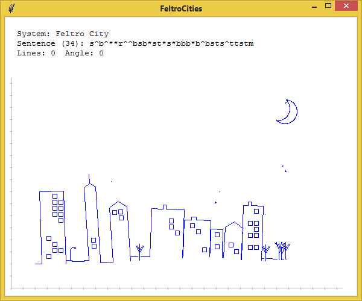
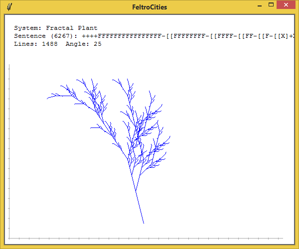
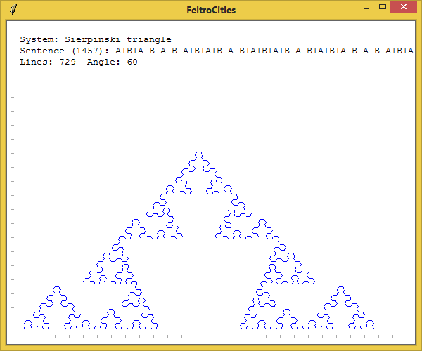

# FeltroCities
A TCL/TK script I used to generate night cityscapes for another project, and well-known L-systems.

This was an exploratory exercise, so it's just for demonstration, the UI is weak without any options.

A sentences.txt file with the expanded sentences generate is created (append, always growing!) if -d is added to the command line.

There are some 9 systems. The Feltro Cityscape randomnly changes a few details each time it is generated.

Under Linux it should run if you set the file's executable bit. On Windows you need to run it with wish.exe (I just associate .tk files to wish.exe)

Some examples below.

Have fun :)

